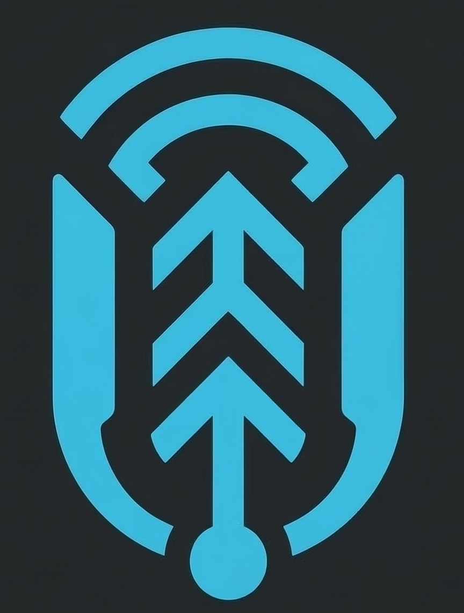

<p align="center">
  
</p>

<h1 align="center">Uplink</h1>

<p align="center">
  A local web UI for browsing, searching, and analysing your Claude Code conversation history.
</p>

<p align="center">
  
  
  
</p>

---

## What is Uplink?

Claude Code writes a full JSONL transcript of every session to `~/.claude/projects/`. Uplink reads those files and presents them in a clean dark-mode browser UI — so you can jump to any past conversation, search across all sessions, inspect token usage, and spot context-rot before it affects your next prompt.

No data ever leaves your machine. Uplink is a local-only Flask server.

---

## Installation

```bash
# Clone and install (editable)
git clone https://github.com/yourname/claude-code-cli-enhanced
cd claude-code-cli-enhanced
pip install -e .
```

**Requirements:** Python 3.11+ · Claude Code installed and authenticated

---

## Usage

```bash
# Launch from your project directory
cd /path/to/your/project
uplink

# Custom port
uplink --port 8080

# Point at a specific directory without cd-ing
uplink --dir /path/to/project

# Don't open the browser automatically
uplink --no-browser
```

Uplink opens `http://localhost:5000` in your default browser. Press `Ctrl+C` to stop the server.

---

## Features

### Session Browser

- **Folder tree** — sessions are grouped by project directory; folders expand and collapse independently
- **Newest-first ordering** — most recent sessions always appear at the top within each folder
- **Session preview** — first prompt shown inline so you can identify sessions at a glance
- **Prompt count badge** — number of user prompts shown on every session row
- **Auto-refresh** — the sidebar refreshes every 5 seconds, picking up new sessions as Claude Code writes them

### Prompts Panel

- Lists all user prompts in the active session, numbered in order
- Click any prompt to jump directly to that exchange in the conversation pane
- **Show all** pin at the top clears any active filter and returns to the full session view
- **Token usage summary** beneath each prompt (input ↑ / output ↓ / estimated cost)

### Context Window Indicators

Each prompt in the sidebar carries a colour-coded fill bar showing how full the context window was when Claude generated its response:

| Colour | Fill | Meaning |
|--------|------|---------|
| Green  | < 50% | Plenty of room |
| Amber  | 50–75% | Getting full |
| Orange | 75–90% | High — earlier context may receive less attention |
| Red    | > 90% | Critical — consider starting a fresh session |

The same colour scale is applied as a left-border on every exchange in the conversation pane, giving an at-a-glance risk signal as you scroll.

### Conversation Pane

- Full markdown rendering of Claude's responses, including syntax-highlighted code blocks
- Collapsible tool-use blocks (file edits, bash runs, etc.) — collapsed by default to reduce noise
- Per-exchange token stats footer (input, output, cache reads, estimated cost)
- **Filtered mode** — click a prompt to isolate just that exchange; a banner appears with a one-click "Show all" to return to the full view
- Imported session banner for sessions shared from other machines

### Search

- Full-text search across **all** sessions and all projects simultaneously
- Results show the matching snippet with the query term highlighted
- Click any result to jump directly to the session and exchange that matched
- Works across both user prompts and Claude's responses

### Session Export

Every session row has an export icon (left of the prompt count badge) with two formats:

- **JSON** — full structured export including all messages, roles, timestamps, token usage, and tool calls. Can be re-imported into any Uplink instance.
- **Markdown** — human-readable transcript with all exchanges formatted as blockquote / prose pairs, and tool calls as collapsible `<details>` blocks.

### Session Import

Share sessions between machines or team members:

1. Click **Import** in the Sessions header and select a `.json` export file
2. The session appears under the **Imported** tab with a gold highlight
3. Imported sessions persist across restarts (stored in `~/.uplink/imports/`)
4. Remove an import at any time via the trash icon on the session row or from within the conversation view

The Sessions header toggles between **Local** and **Imported** tabs whenever imported sessions are present, keeping the two lists cleanly separated.

### Stats View

Open the Stats panel (top-right **Stats** button) for usage analytics across all sessions.

#### Most Costly Prompts

A sortable table of every prompt exchange with token usage data. Columns:

| Column | Description |
|--------|-------------|
| Prompt | First 90 characters of the user message; double-click to jump to the exchange |
| Project | Abbreviated project path |
| Date | Session start time |
| Model | Opus / Sonnet / Haiku |
| Depth | Position of this prompt within its session (1st, 2nd, …) |
| **Context** | Context window fill % when Claude generated the response — colour-coded green→red with a mini fill bar. Tooltip shows the risk tier: Low / Medium / High / Critical |
| Input ↑ | Input tokens (fresh, not cached) |
| Output ↓ | Output tokens |
| Cached ⚡ | Cache-read tokens |
| Cost | Estimated USD cost at Anthropic list pricing |

Click any column header to sort; click again to reverse.

#### Estimated Daily Usage

Bar chart of daily spend over a configurable window (1 week → 1 year) with a secondary line showing remaining monthly budget against a $300/month baseline. Toggle a **Tokens** view to see input/output/cached token volumes instead of cost.

#### Cache Efficiency

Three charts covering your caching behaviour:

- **Cache Token Volume & Hit Rate** — daily cache write vs read volumes with an overlaid hit-rate % line
- **Estimated Daily Cache Savings** — dollars saved per day because cache-read tokens are billed at ~10% of the standard input rate
- **Cache Hit Rate by Session Depth** — average hit rate by prompt position within a session (1st, 2nd, … 11th+), colour-coded by effectiveness

#### Context Usage

Line chart showing context window fill across every prompt turn for a selected project:

- One entry per project in the dropdown — all session files for the same project are merged into a single series
- **⟳ reset markers** (triangle points) show where Claude Code exhausted the context window and started a new session file, causing context to drop back to near-zero
- Reference lines at **50%** (100k), **75%** (150k), and **90%** (180k) tokens
- Tooltip on each point shows the prompt preview and flags context-reset points
- The fill line is gradient-coloured using the same green→amber→red scale as the sidebar bars

---

## Resizable Layout

Both the horizontal split between the sidebar and conversation pane, and the vertical split between the Sessions and Prompts panels inside the sidebar, are draggable. Sizes are saved to `localStorage` and restored on next launch.

---

## Project Structure

```
claude-code-cli-enhanced/
├── README.md
├── SPEC.md                     # original design specification
├── pyproject.toml
├── uplink/
│   ├── __main__.py             # CLI entry point (click)
│   ├── server.py               # Flask routes + JSON API
│   ├── reader.py               # JSONL session parser + TTL cache
│   ├── static/
│   │   └── logo.png
│   └── templates/
│       └── index.html          # single-page UI (Bootstrap 5 dark)
└── tests/
    ├── test_parser.py
    ├── test_reader.py
    └── test_store.py
```

---

## How It Works

Claude Code writes one JSONL file per session to:

```
~/.claude/projects/<encoded-project-path>/<session-id>.jsonl
```

Each line is a JSON record with a `type` (`user` or `assistant`), the message content, timestamp, and token usage. Uplink's `reader.py` parses these files, deduplicates prompts that appear replayed across continuation session files, and serves the data via a Flask JSON API. The single-page UI polls the API every 5 seconds to pick up new activity.

When Claude Code exhausts the context window mid-session it starts a new JSONL file, replaying the full conversation history as the new file's preamble. Uplink detects this and deduplicates at both the session level (by session ID) and the message level (by prompt UUID), so each prompt appears exactly once in the stats.

---

## Dependencies

| Package | Purpose |
|---------|---------|
| `flask` | HTTP server and template rendering |
| `click` | CLI argument parsing |

Front-end assets are loaded from CDN at runtime (no build step):

| Library | Purpose |
|---------|---------|
| Bootstrap 5.3 | Layout and dark theme |
| Bootstrap Icons 1.11 | Icon set |
| marked.js 11 | Markdown rendering |
| highlight.js 11.9 | Code block syntax highlighting |
| Chart.js 4.4 | Stats charts |

---

## Token Pricing

Cost estimates use Anthropic list prices as of August 2025:

| Model | Input | Output | Cache read | Cache write |
|-------|-------|--------|------------|-------------|
| Opus | $15 / Mtok | $75 / Mtok | $1.50 / Mtok | $18.75 / Mtok |
| Sonnet | $3 / Mtok | $15 / Mtok | $0.30 / Mtok | $3.75 / Mtok |
| Haiku | $0.80 / Mtok | $4 / Mtok | $0.08 / Mtok | $1.00 / Mtok |

Estimates are indicative only. Check [anthropic.com/pricing](https://www.anthropic.com/pricing) for current rates.

---

## License

MIT
